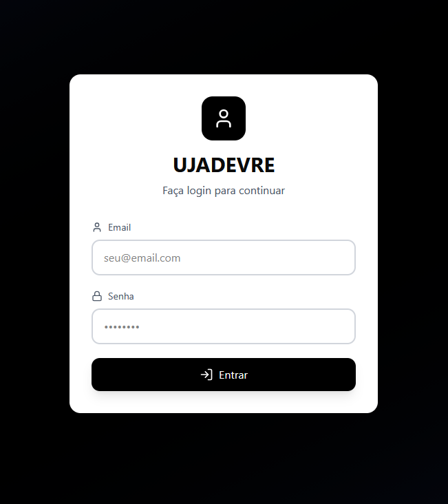
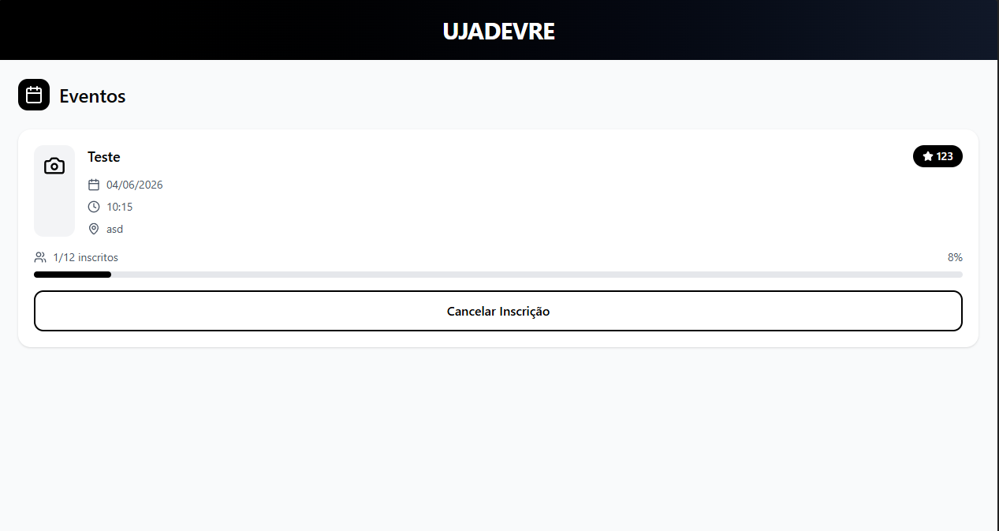
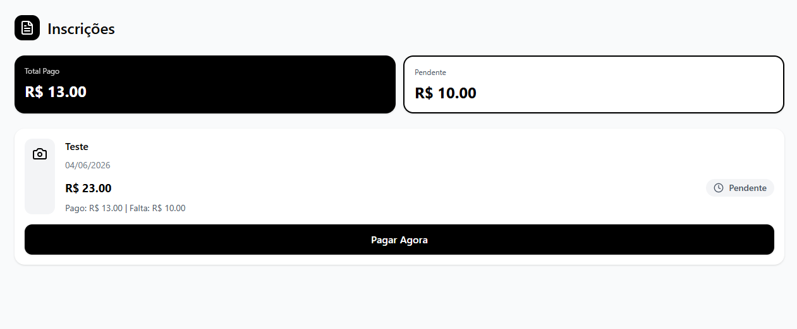
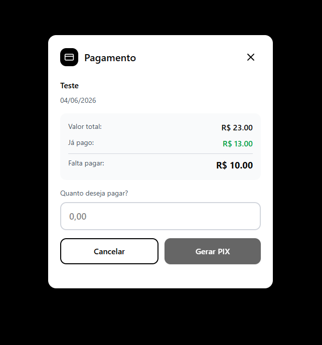
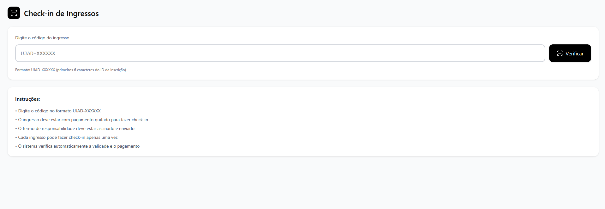
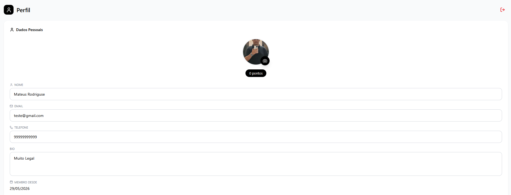
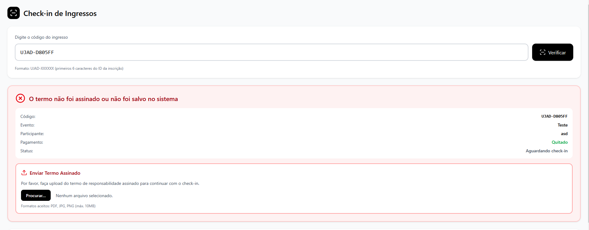
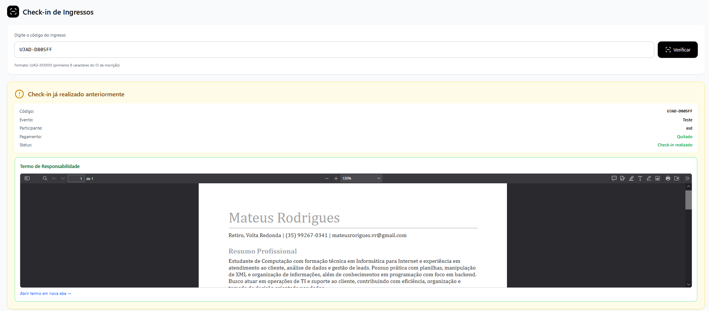

<h1 align="center">UJADEVRE</h1>

<p align="center">
<strong>Plataforma completa para gerenciamento de eventos,
inscrições, pagamentos e check-in.</strong>
</p>

<p align="center">
Transformando processos manuais em uma experiência digital moderna,
rápida e segura.
</p>

<p align="center">


</p>

------------------------------------------------------------------------

## Sobre

O **UJADEVRE** é uma plataforma desenvolvida para centralizar o
gerenciamento de eventos em um único ambiente. O sistema permite
administrar eventos, inscrições, pagamentos via PIX, documentos, perfis
de participantes e check-in.

## Funcionalidades

-   Gestão de eventos
-   Inscrição online
-   Pagamento via PIX
-   QR Code automático
-   Check-in
-   Painel administrativo
-   Perfil do participante
-   Upload de documentos
-   Armazenamento em nuvem

## Stack

### Front-end

-   React
-   TypeScript
-   Vite
-   Tailwind CSS
-   Axios

### Back-end

-   NestJS
-   Prisma ORM
-   PostgreSQL
-   JWT
-   Multer

## Arquitetura

``` text
React
   │
NestJS API
   │
Prisma ORM
   │
PostgreSQL
```

## Galeria

> ## Tela de Login



> ## Tela de Eventos



> ## Tela de inscrições



> ## Painel de pagamento


> ## Modal de pagamento



> ## Tela do Pix Gerado (Pix falso)


> ## Tela de Check-In 



> ## Tela de Perfil



> ## Termo não enviado



> ## Check-in realizado e termo enviado



## Roadmap

-   [ ] Dashboard
-   [ ] Aplicativo Mobile
-   [ ] Relatórios PDF
-   [ ] Exportação Excel
-   [ ] Notificações
-   [ ] Multi-organizações

## Estrutura

``` text
client/
server/
docs/
README.md
```

## Desenvolvedor

**Mateus Rodrigues da Silva**

-   Email: mateusrorigues.vr@gmail.com
-   LinkedIn:
    https://www.linkedin.com/in/mateus-rodrigues-da-silva-9835b7348/
-   Instagram: @mateusrwx

------------------------------------------------------------------------

Se este projeto foi útil, considere deixar uma ⭐ no repositório.
